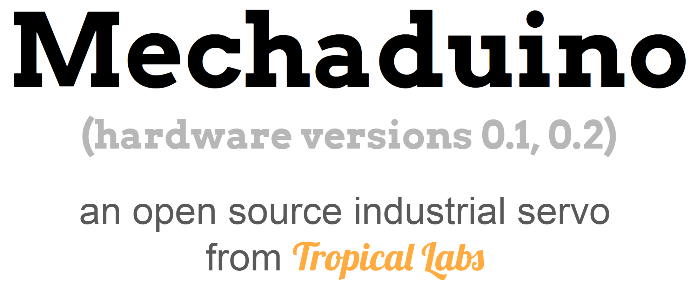

Here are some preliminary instructions on how to get your Mechaduino up and running.  We will continue to improve this documentation in the coming weeks...this rough overview is just to point anyone who is curious in the right direction!

## Bootloader:
You will need to make sure your Mechaduino has the latest Arduino Zero bootloader.  If you are getting a Mechaduino as a reward from our Kickstarter, it will already have this! Otherwise you will need an Atmel-ICE or similar SWD programmer...

## Firmware:

Compile the Mechaduino_01 firmware in the Arduino IDE and upload to your Mechaduino.(Mechaduino will appear as an Arduino Zero) New firmware is in the default "master" branch, an older version is available in the multi-file branch and also here(https://github.com/jcchurch13/Mechaduino-Firmware/releases) 

## Calibration Routine:

The first thing you will need to do is run the encoder calibration routine.

With the Mechaduino connected to your computer, open a serial monitor (115200 baud) in the Arduino IDE.  You will need to provide V+ to the Mechaduino to power the motor drivers (needed to calibrate).  Type "s" and press enter a couple times to verify that everything is working.  The Mechaduino should step like a stepper.  It is currently in open loop mode.  press "d" and the stepping direction will change.  

Now, make sure nothing will touch the Mechaduino shaft during calibration. Type "c"  to start the calibration routine.  The Mechaduino will now step through all full steps to calibrate the encoder.   When the routine is done, a very long lookup table (16,384 entries) will be printed to the serial terminal.  These are the calibrated angles at each encoder count.  You will need to copy these into the Parameters.cpp file here:

const PROGMEM float lookup[] = {PUT LOOKUP TABLE HERE}

Note: you can easily select the whole lookup table from the serial monitor by clicking on the next line and dragging the cursor up.

Save, compile, and re-upload the firmware to your Mechaduino.  you are all calibrated.

## Basic Commands:

As long as you have "serialCheck();" in your main loop, you can use the following built in commands to control the mechaduino from a serial monitor:

  
 s  -  step
 d  -  dir
 p  -  print angle [step count] , [assumed angle] , [encoder reading]

 c  -  calibration routine
 e  -  check encoder diagnositics
 q  -  parameter query

 x  -  position mode
 v  -  velocity mode
 x  -  torque mode

 y  -  enable control loop
 n  -  disable control loop
 r  -  enter new setpoint

 k  -  edit controller gains -- note, these edits are stored in volatile memory and will be reset if power is cycled
 m  -  print main menu

  ...see serialCheck() in Utils for more details
  

## Coming Soon:
We're almost ready to release a manual explaining the Mechaduino hardware & firmware.  Stay tuned!

##License

All Mechaduino related materials are released under the
[Creative Commons Attribution Share-Alike 4.0 License](https://creativecommons.org/licenses/by-sa/4.0/)
